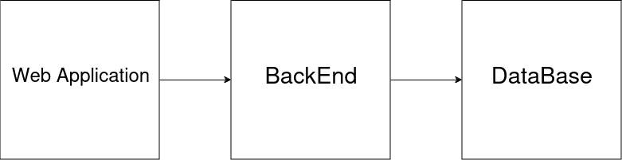
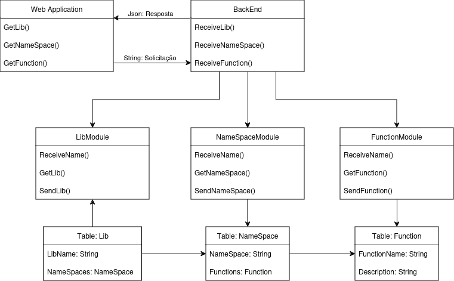

# DynamDocumentation

Esse projeto busca facilitar a leitura de documentações de diversos projetos e bibliotecas de diversas linguagens. Colocando todas essas documentações dentro de um único site.

Poderemos escolher a linguagem que queremos visualizar, as bibliotecas dessas linguagem e, em seguida, as classes e funções dessa biblioteca.

# O que usaremos
- Vuejs
- Ktor
- MariaDB

# Requistos
## Vuejs
+ Install Node.js version 18.3 or higher
'''bash
npm create vue@latest
'''

## Ktor
+ JDK 8+ installed
+ Gradle or Maven for dependency management

## MariaDB
No requirements

## Ciclos

### Ciclo 1
- Planejar o tamanho do projeto (quanto vai cobrir)
- Criar um projeto Ktor e ReactJS, e fazer a integração
- Diagrama de Classes 🚀🌌✅

# Diagramas de Classe

## Diagrama Simples

## Digrama Completo

